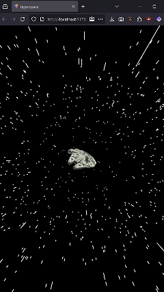

# Hyperspace App



## Description

This React + TypeScript + Vite application simulates a lightspeed journey through space, with stars flying towards the center of the screen and a spaceship in the middle. The effect is implemented using HTML Canvas for better performance and realistic rendering.

## Features

* 3D starfield simulating warp speed.
* Light trails behind each star.
* Centered image (spaceship).
* Responsive and high-performance thanks to Canvas.

## Installation

```bash
npm install
npm run dev
```

Open your browser at the provided URL (default is `http://localhost:5173`).

## Project Structure

* `src/Starfield.tsx` : main Starfield component.
* `src/App.tsx` : imports the Starfield component.
* `public/ship.png` : centered spaceship image.
* `src/App.css` : global styles and canvas.

## Notes

No external dependencies are required for the animation; everything is handled with Canvas and React. The effect is similar to the well-known site [starfield.js](https://starfield.js.org/).
